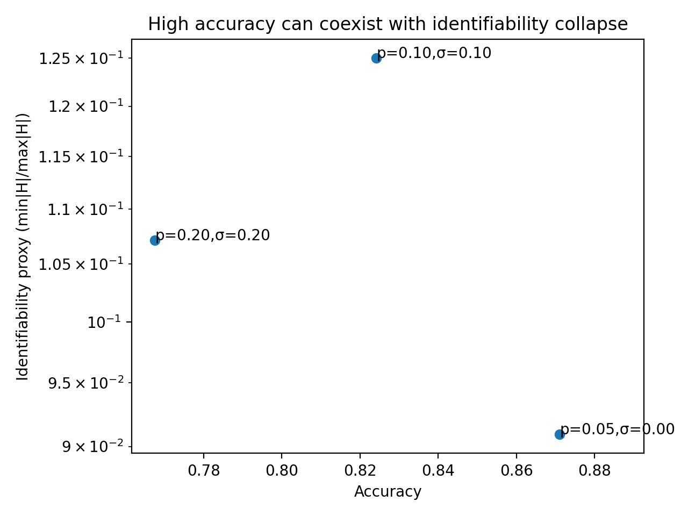
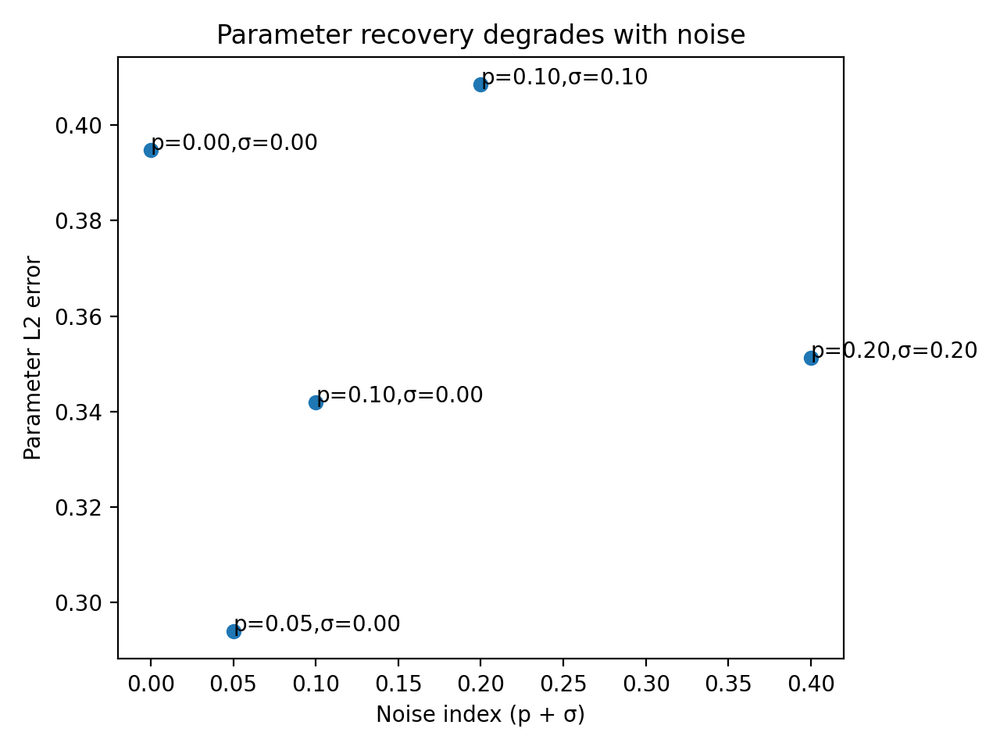

# Noise-Aware QNN Identifiability

*Accuracy does not guarantee recoverability under noise.*

<br>

<br>

[](https://www.python.org/downloads/)
[](https://opensource.org/licenses/MIT)

[](https://scholar.google.com/citations?user=tvwpCcgAAAAJ)
[](https://huggingface.co/Cohaerence)
[](https://x.com/coherence)
[](https://www.christopheraltman.com)
[](https://www.linkedin.com/in/Altman)
<!-- [](https://doi.org/10.5281/zenodo.XXXXXXX) -->

## Overview

This repository presents a controlled, fully reproducible micro‑study demonstrating a specific and important verification failure mode in noisy quantum (and quantum‑inspired) learning systems:

**High predictive accuracy can coexist with a collapse of parameter identifiability.**

In other words, a model may continue to perform well on its task while the underlying parameters become fundamentally non‑recoverable due to noise‑induced degeneracy in the loss landscape. When performance survives noise, identifiability may not.

This project is intentionally minimal. Its purpose is not to build a large framework, but to isolate and make visible a phenomenon that is often hidden by aggregate performance metrics.

---

## Problem / Phenomenon Investigated

In the presence of noise, many distinct parameter settings can become **behaviorally indistinguishable**: they produce nearly identical outputs on the task distribution.

In such regimes:

- Task accuracy may remain high.
- Loss values may appear well‑behaved.
- Gradient‑based optimization may still converge.

Yet **recovering the generating parameters** (or even determining whether recovery is possible) becomes ill‑posed.

In this repository, *identifiability* is defined operationally as follows:

> Given data generated by a fixed ground‑truth parameter vector, can we reliably recover that vector (or detect that recovery is fundamentally unstable)?

---

## Hypothesis

As physically motivated noise increases:

- **Task accuracy remains high**, indicating behavioral success.
- **Loss curvature collapses**, producing flat or ill‑conditioned directions.
- **Parameter recovery becomes unreliable**, even when predictions remain correct.

This creates a verification gap between *performance* and *recoverability*.

---

## Method

### Data Generation

- Binary classification labels are generated using a known, fixed ground‑truth parameter vector θ*.
- Inputs are randomly sampled and embedded via a simple normalized feature map.

### Model

- A minimal QNN‑like forward function computes a score via the dot product between:
  - the embedded input vector, and
  - a normalized parameter vector.
- The sign of the score determines the predicted label.

This abstraction is deliberately lightweight to keep the phenomenon visible and interpretable.

### Noise Model

Two lightweight, physically inspired noise proxies are applied to the embedded input:

1. **Depolarizing‑like noise (p)**  
   With probability `p`, the embedded state is replaced by a random unit vector.

2. **Phase‑like noise (σ)**  
   Additive Gaussian perturbation applied to the embedded state.

Noise is swept across multiple (p, σ) regimes.

### Optimization

- A small random‑search optimizer is used.
- No deep learning frameworks are employed.
- This avoids optimizer‑specific artifacts and keeps dependencies minimal.

### Metrics

Three quantities are measured:

1. **Task performance**  
   Classification accuracy.

2. **Parameter recovery error**  
   ||θ̂ − θ*||₂.

3. **Identifiability proxy**  
   A curvature‑based measure computed from a finite‑difference estimate of the Hessian diagonal:

   min |Hᵢᵢ| / max |Hᵢᵢ|.

   Values approaching zero indicate flat or ill‑conditioned loss directions, signaling poor identifiability.

---

## Results

### Accuracy vs. Identifiability

**Key result:** high accuracy can coexist with identifiability collapse.

The identifiability axis is plotted on a logarithmic scale to emphasize near‑zero curvature collapse.



### Parameter Recovery vs. Noise

Parameter recovery error generally increases with noise, but not necessarily monotonically due to finite‑sample effects and non‑convex optimization dynamics.



---

## Interpretation

This repository demonstrates a concrete evaluation failure mode:

**Performance metrics alone are insufficient under noise.**

Even when a model achieves strong predictive accuracy, the loss landscape may contain broad flat regions where many parameter settings are effectively equivalent. In such regimes:

- Parameter estimates become unstable.
- Interpretability degrades.
- Verification based solely on task performance becomes misleading.

This motivates the use of **identifiability‑aware evaluation** (and eventually identifiability‑aware objectives) in hardware‑relevant quantum machine learning systems and safety‑critical deployments.

---

## Reproducibility

From the repository root, run:

```bash
python -m src.main
```

This execution produces the following artifacts in the repository root:

- `fig_accuracy_vs_identifiability.png`
- `fig_param_error_vs_noise.png`

All results are deterministic under the fixed random seed specified in the code.

---

## Implementation Notes

- Language: Python
- Required dependencies:
  - numpy
  - matplotlib
- No external quantum software development kits are required.
- The code is structured to emphasize clarity and reproducibility over performance.

---

## Tags

quantum machine learning ; quantum machine learning simulation ; neural quantum models ; variational quantum circuits ; verification ; identifiability ; noise robustness

---

## Why This Matters

**For frontier research:**  
This work highlights a failure mode where models appear successful but are fundamentally non‑recoverable, relevant to interpretability, alignment, and verification research.

**For space systems:**  
Verification under noise is critical for deployment in hardware‑constrained, safety‑critical environments where parameter instability can have downstream operational consequences.

---

## References

1. McClean, J. R., Boixo, S., Smelyanskiy, V. N., Babbush, R., & Neven, H. (2018). *Barren plateaus in quantum neural network training landscapes.* arXiv:1803.11173.
2. Cerezo, M., Arrasmith, A., Babbush, R., et al. (2021). *Variational Quantum Algorithms.* arXiv:2012.09265. (Review of VQAs, including trainability and noise constraints.)
3. Wang, S., Fontana, E., Cerezo, M., et al. (2021). *Noise-induced barren plateaus in variational quantum algorithms.* Nature Communications 12, 6961. arXiv:2007.14384.
4. Stokes, J., Izaac, J., Killoran, N., & Carleo, G. (2020). *Quantum Natural Gradient.* Quantum 4, 269. arXiv:1909.02108.
5. Schuld, M., Bergholm, V., Gogolin, C., Izaac, J., & Killoran, N. (2019). *Evaluating analytic gradients on quantum hardware.* Physical Review A 99, 032331. arXiv:1811.11184.
6. Singkanipa, P., et al. (2025). *Noise-induced barren plateaus and limit sets.* Quantum (2025). (Extends the noise-induced landscape pathology story beyond the unital-noise setting.)

---

## Citations

If you use or build on this work, please cite:

> Noise-Aware QNN Identifiability
```bibtex
@software{altman2025noise-aware-qnn-identifiability,
  author  = {Christopher Altman},
  title   = {Noise-Aware QNN Identifiability},
  year    = {2025},
  version = {0.1.0},
  url     = {https://github.com/christopher-altman/noise-aware-qnn-identifiability},
}
```
---

## License

MIT License. See `LICENSE`.

---

## Contact

- **Website:** [christopheraltman.com](https://christopheraltman.com)
- **Research portfolio:** https://lab.christopheraltman.com/
- **Portfolio mirror:** https://christopher-altman.github.io/
- **GitHub:** [github.com/christopher-altman](https://github.com/christopher-altman)
- **Google Scholar:** [scholar.google.com/citations?user=tvwpCcgAAAAJ](https://scholar.google.com/citations?user=tvwpCcgAAAAJ)
- **Email:** x@christopheraltman.com

---

*Christopher Altman (2025)*